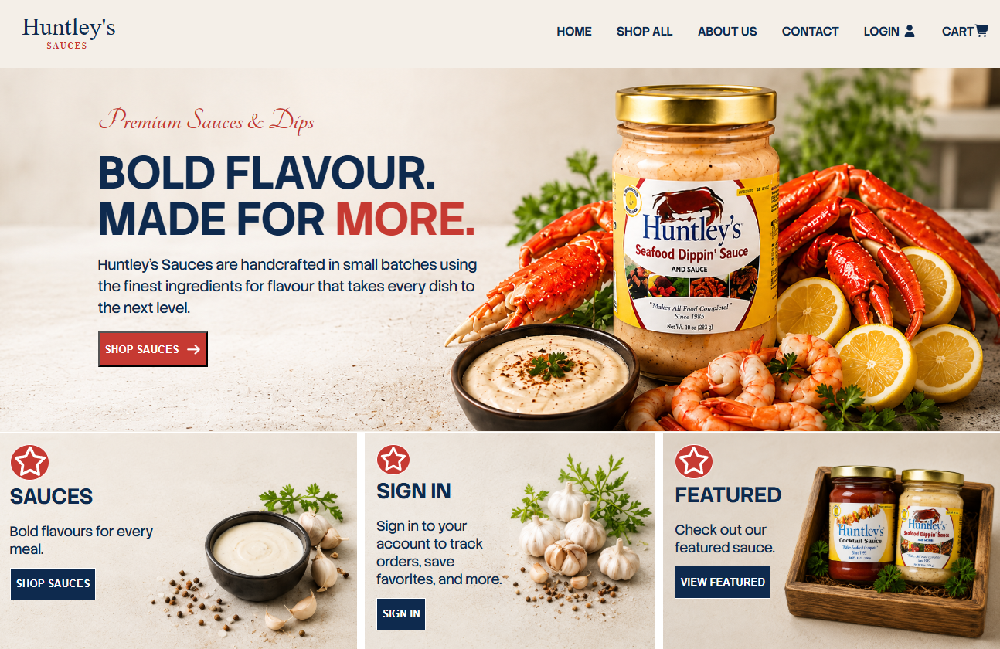

# Huntley's Sauces

**Status:** Live

[Website](https://huntleysauce.com)

## Screenshot

## Overview

A full-stack MERN e-commerce application built and deployed as a client project for Huntley's Sauces, a condiment business based in Maryland. The site handles the complete purchase flow — browsing products, managing a persistent cart, user authentication, multi-step checkout, and live payment processing through PayPal. It also includes a role-protected admin dashboard for managing products, orders, and users, plus a contact form integrated with a transactional email service. Built with a custom CSS design system (no UI framework), secure JWT authentication via HTTP-only cookies, and cloud-based image hosting.

## Features

- Browse products and view individual product details
- Persistent shopping cart with quantity selection
- User registration and login with JWT authentication (HTTP-only cookies)
- Multi-step checkout: shipping, payment method, place order
- Live PayPal and credit/debit card payments
- Order history and user profile
- Admin dashboard: create/edit/delete products, manage users, mark orders delivered
- Product image uploads via Cloudinary
- Contact form with email delivery to the business
- Responsive design for mobile and desktop

## Technologies Used

- React
- React Router
- Redux Toolkit + RTK Query
- Node.js / Express
- MongoDB / Mongoose
- JWT authentication
- PayPal API
- Cloudinary (image hosting)
- Resend (transactional email)
- CSS
- Vite
